# Stage 1 Report — Few-Shot Classification Baselines on Frozen Embeddings

**Project:** Few-Shot Classification with Flow Matching (Stage 1 of 3)
**Author:** Alon Engel
**Datasets:** MNIST · CIFAR-10 · Mini-ImageNet
**Date:** July 2026

---

## Abstract

We establish few-shot classification baselines over frozen pretrained embeddings on MNIST, CIFAR-10 and Mini-ImageNet, as the reference point for the Flow-Matching architectures of Stages 2–3. Three classifier heads — nearest-prototype, a linear probe trained with cross-entropy, and zero-shot CLIP as a semantic reference — are evaluated under two protocols (episodic 5-way K-shot with 600 fixed episodes, and all-classes K-shot over 10 seeds), with the prototype and probe heads compared across three backbones (CLIP ViT-B/32, DINOv2 ViT-S/14, ResNet-50). Two findings dominate: embedding quality matters more than head choice, and zero-shot CLIP is the strongest baseline on natural images (93.2% CIFAR-10, 99.1% Mini-ImageNet 5-way) while collapsing on MNIST (48% all-classes), where prompt ensembling further *hurts* accuracy. With CLIP embeddings the linear probe beats the prototype head at every setting tested (paired per-episode CIs); across encoders the ranking flips, showing that head choice cannot be judged independently of embedding geometry. All support/query episode indices, embeddings, prototypes and text embeddings are committed as fixed artifacts, so Stages 2–3 compare against these baselines on identical data.

## 1 · Introduction

Few-shot classification asks a model to recognize classes from a handful of labeled examples ("shots"). A strong and now-standard recipe is to *freeze* a pretrained encoder and learn only a lightweight decision rule over its embeddings. Stage 1 establishes rigorous baselines for exactly this setting. Its purpose is **selection, not ranking**: the goal is not to declare one head better than another, but to find the *strongest configuration of each classifier function* — the best encoder per head per dataset — so that Stages 2–3, which replace or augment the decision rule with a Flow Matching model, are measured against the hardest possible baseline on identical data (§4, "Selected reference baselines").

We evaluate three classifier heads over frozen embeddings:

1. **Prototype classifier** (Snell et al., 2017 style): each class is represented by the mean of its support embeddings; queries are assigned to the nearest prototype (cosine similarity primary; negative squared Euclidean as an ablation).
2. **Linear probe**: a PyTorch `nn.Linear` layer trained with `CrossEntropyLoss` on the support set only.
3. **Zero-shot CLIP** (Radford et al., 2021): a *semantic reference baseline* based on class names and pretrained image–text alignment. It receives no support images at all — queries are scored by cosine similarity between image embeddings and text embeddings of class-name prompts. Note the information asymmetry: the prototype and linear heads consume labeled support *images*, while zero-shot CLIP consumes class *names* plus semantic knowledge acquired during CLIP pretraining — it is an important reference, not an equivalent few-shot method.

## 2 · Methods

### 2.1 Frozen backbones (ADR 0001)

| Backbone | Source | Embedding dim |
|---|---|---|
| CLIP ViT-B/32 (**primary**) | official OpenAI `clip` package | 512 |
| DINOv2 ViT-S/14 | `facebook/dinov2-small` (CLS token) | 384 |
| ResNet-50 (ImageNet-1k) | torchvision, penultimate layer | 2048 |

All backbones are frozen; embeddings are extracted once per (dataset, split, backbone) with each backbone's own preprocessing and cached to disk (fp32). MNIST images are replicated to 3 channels. The full classifier suite runs on CLIP embeddings; the prototype classifier is additionally compared across all three backbones.

### 2.2 Datasets and splits

- **MNIST / CIFAR-10** (torchvision): official train/test splits. Episodic evaluation samples from the test split; simple-protocol support sets are drawn from the train split and evaluated on the full test split.
- **Mini-ImageNet**: `timm/mini-imagenet` (100 ImageNet classes, 65,000 images), re-partitioned by *class* according to the canonical Ravi & Larochelle 64/16/20 split (committed as `config/mini_imagenet_splits.json`, with wnid → readable-name mapping for CLIP prompts). Episodic evaluation uses the 20 **test** classes (13,000 images, 650 per class), which are disjoint from any class used elsewhere.

### 2.3 Evaluation protocols

- **Episodic**: 5-way, K ∈ {1, 5} shots, 15 queries per class, 600 episodes. Support and query sets are disjoint by construction. Reported: mean accuracy ± 95% CI (1.96 · s/√600 over per-episode accuracies). For MNIST/CIFAR-10, episodic support *and* query are drawn from the test split — standard for episodic evaluation and leakage-free since nothing is trained or tuned on them beyond the per-episode support fit; the simple protocol below instead draws support from the train split (the asymmetry is deliberate and protocol-conventional).
- **Simple all-classes K-shot** (MNIST/CIFAR-10): K ∈ {1, 5, 10} support images per class drawn from the train split, full 10,000-image test set, 10 seeds. Reported: mean ± sample std over seeds. Zero-shot CLIP ignores support, so it is reported once per dataset (it is exactly K- and seed-independent).

**Cross-method comparisons.** Because all methods share identical episodes (ADR 0002), any claim of the form "method A beats method B" — in this stage or when Stages 2–3 compare against these baselines — is to be made with **paired** statistics: a CI on the per-episode accuracy *differences*, not by eyeballing overlap of two marginal CIs (overlapping marginal CIs do not imply non-significance, and paired CIs are far tighter). The saved raw per-episode arrays make this straightforward.

**Fixed episodes (ADR 0002).** All support/query indices were sampled once (seed 42; simple-protocol seeds 0–9) and committed to `results/artifacts/episodes/`. Every classifier in every stage of this project is evaluated on these exact files. Figure 1 shows one such committed episode.

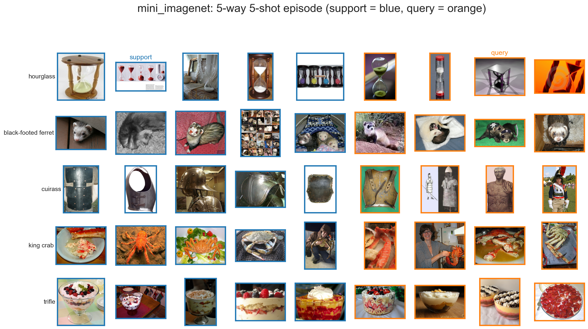
*Figure 1 — One committed 5-way 5-shot Mini-ImageNet episode (support in blue, query in orange). Every method — in this stage and in Stages 2–3 — sees exactly these images.*

### 2.4 Classifier details

- **Prototype**: no training; prototypes recomputed per episode from support only.
- **Linear probe**: linear head (weights + bias as in `nn.Linear`), CrossEntropyLoss, Adam (300 steps, lr 0.01), trained on support embeddings only. For episodic evaluation the 600 per-episode heads are optimized jointly as one batched tensor `[600, C, dim]` with the loss summed over episodes and scaled by 1/S — each head then receives exactly its independent-head mean-CE gradient, so this is equivalent to 600 independent heads. The equivalence and the speedup are verified empirically in the benchmark of §6 (Figure 14): identical predictions on all 45,000 queries of every config, 373–455× faster. Weight init is 0.01·N(0,1) (not `nn.Linear`'s default Kaiming-uniform), fixed a priori.
- **Zero-shot CLIP**: dataset-specific prompt templates (e.g. `'a photo of the number: "{}".'` for MNIST, `'a photo of a {}.'` for CIFAR-10/Mini-ImageNet); we report a single-prompt variant and a prompt-ensemble variant (mean of per-template normalized embeddings, re-normalized). In episodic mode only the episode's 5 classes are scored — the correct protocol for N-way comparability (every head faces the same 5-way decision), but note these numbers are therefore *not* comparable to full-label-set zero-shot accuracies in the literature.
- **Multi-prototype (k-means) ablation**: n_centers ∈ {1, 2, 3} spherical k-means centers per class, computed from that class's **support embeddings only** (query data never enters clustering; deterministic seeded initialization); a query is scored by its maximum cosine similarity over a class's centers. n_centers = 1 is exactly the cosine prototype (verified per-episode identical), so only n ∈ {2, 3} are additionally run, and only where K ≥ n_centers (episodic 5-shot; simple 5/10-shot).

Figure 2 shows the three head architectures side by side.

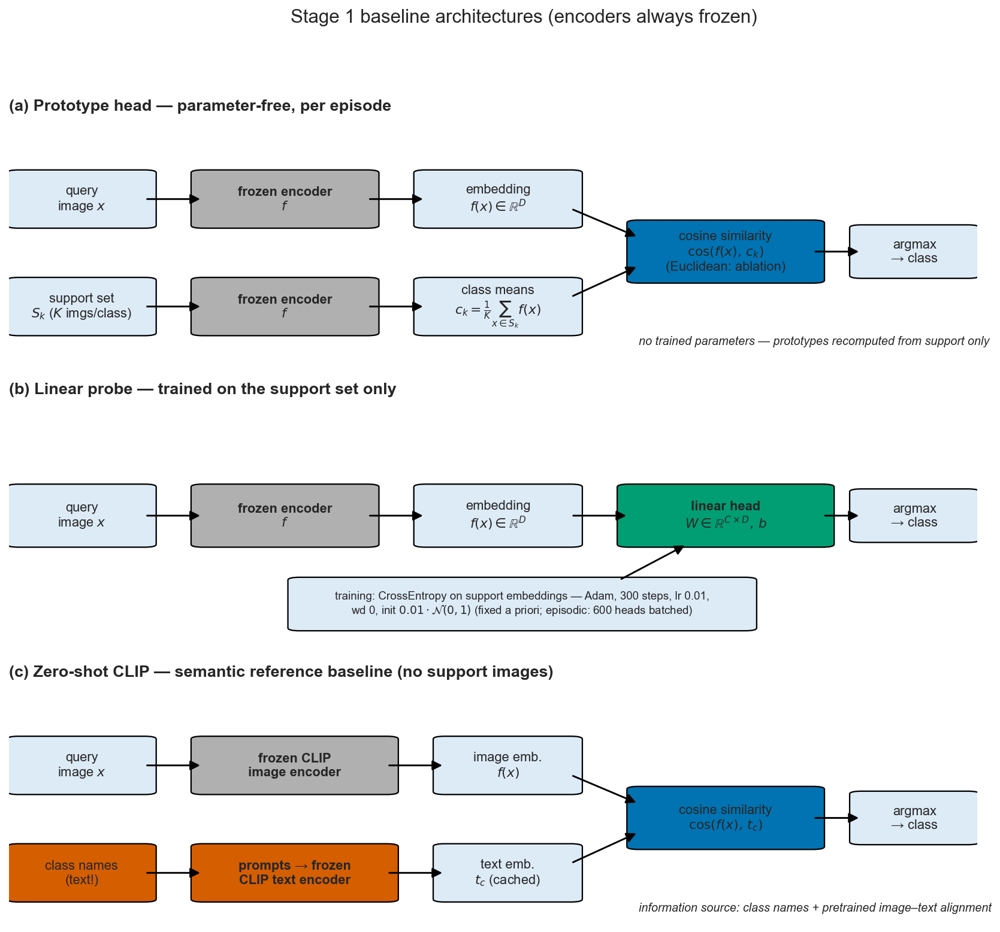
*Figure 2 — Stage 1 baseline architectures. Encoders are always frozen; the prototype head is parameter-free, the linear head trains on support embeddings only, and zero-shot CLIP replaces support images with class-name text embeddings.*

### 2.5 Hyperparameter provenance

All hyperparameters were fixed **a priori**, before observing any test metric, and were not adjusted afterwards: the linear-probe budget (Adam, 300 steps, lr 0.01) follows standard frozen-feature linear-probe practice (cf. the linear-evaluation protocols in Radford et al., 2021 and Chen et al., 2020) and was carried over from prior coursework on other datasets; cosine similarity as the primary prototype metric is the modern default (with the classic Euclidean form of Snell et al., 2017 reported as an ablation); prompt templates are drawn from the published OpenAI CLIP prompt lists for MNIST/CIFAR/ImageNet-style datasets. No hyperparameter or selection decision uses test data. The Mini-ImageNet validation classes (16 classes of the R&L split) serve exactly one purpose — their canonical one: the **final embedding selection** of §4 runs on episodes drawn from these validation classes (and, for MNIST/CIFAR-10, from the train split), never from test data.

### 2.6 Reproducibility

Per-episode / per-seed raw accuracies are saved (`results/metrics/raw/`); `scripts/repro_check.py` re-derives every table number from these artifacts. Re-running experiments on the same GPU reproduces the raw arrays bit-exactly; CPU recomputation can flip isolated queries that are genuine float ties (top-2 cosine margins ~1e-7), so cross-device comparisons in Stages 2–3 should use the committed arrays, not device re-runs. `results/runtime_summary.json` records versions and hardware (AMD RX 7900 XTX, torch 2.9.1+rocm7.2.1, Python 3.12.3). All randomness is seeded.

## 3 · Results

All numbers are re-derivable from the committed raw artifacts via `scripts/repro_check.py` (last run: 100/100 rows match). Figures referenced below live in `results/figures/`.

### 3.1 Episodic protocol

**5-way 1-shot (600 episodes, accuracy % ± 95% CI):**

| Classifier | MNIST | CIFAR-10 | Mini-ImageNet |
|---|---|---|---|
| Prototype (cosine) — CLIP | 56.56 ± 0.87 | 72.92 ± 0.85 | 89.15 ± 0.64 |
| Prototype (Euclidean) — CLIP | 56.64 ± 0.87 | 74.07 ± 0.82 | 90.09 ± 0.61 |
| Linear probe — CLIP | **59.96 ± 0.86** | 76.86 ± 0.80 | 91.40 ± 0.57 |
| Zero-shot CLIP (single prompt) | 59.61 ± 0.88 | 93.14 ± 0.28 | 99.00 ± 0.10 |
| Zero-shot CLIP (prompt ensemble) | 56.98 ± 0.89 | **93.44 ± 0.27** | **99.08 ± 0.10** |
| Prototype (cosine) — DINOv2 | 56.54 ± 0.92 | 77.34 ± 0.72 | 94.42 ± 0.47 |
| Prototype (Euclidean) — DINOv2 | 56.76 ± 0.92 | 75.30 ± 0.77 | 94.57 ± 0.47 |
| Linear probe — DINOv2 | 50.95 ± 0.82 | 72.76 ± 0.74 | 92.92 ± 0.53 |
| Prototype (cosine) — ResNet-50 | 55.96 ± 0.82 | 62.30 ± 0.76 | 97.38 ± 0.26 † |
| Prototype (Euclidean) — ResNet-50 | 55.79 ± 0.83 | 57.12 ± 0.80 | 78.69 ± 1.13 † |
| Linear probe — ResNet-50 | 57.51 ± 0.84 | 61.55 ± 0.74 | 92.15 ± 0.45 † |

**5-way 5-shot (600 episodes, accuracy % ± 95% CI):**

| Classifier | MNIST | CIFAR-10 | Mini-ImageNet |
|---|---|---|---|
| Prototype (cosine) — CLIP | 78.01 ± 0.60 | 89.16 ± 0.42 | 97.70 ± 0.20 |
| Prototype (Euclidean) — CLIP | 77.93 ± 0.60 | 89.23 ± 0.42 | 97.66 ± 0.20 |
| Linear probe — CLIP | **86.60 ± 0.44** | 90.82 ± 0.37 | 98.26 ± 0.16 |
| Zero-shot CLIP (single prompt) | 59.53 ± 0.89 | 93.03 ± 0.28 | 99.02 ± 0.11 |
| Zero-shot CLIP (prompt ensemble) | 55.96 ± 0.89 | **93.22 ± 0.27** | **99.10 ± 0.10** |
| Prototype (cosine) — DINOv2 | 75.61 ± 0.67 | 91.95 ± 0.37 | 98.56 ± 0.15 |
| Prototype (Euclidean) — DINOv2 | 75.60 ± 0.67 | 91.91 ± 0.36 | 98.01 ± 0.17 |
| Linear probe — DINOv2 | 80.18 ± 0.60 | 90.68 ± 0.39 | 98.15 ± 0.17 |
| Prototype (cosine) — ResNet-50 | 76.86 ± 0.70 | 81.68 ± 0.48 | 99.51 ± 0.08 † |
| Prototype (Euclidean) — ResNet-50 | 76.87 ± 0.69 | 81.21 ± 0.48 | 99.29 ± 0.10 † |
| Linear probe — ResNet-50 | 83.30 ± 0.56 | 80.33 ± 0.50 | 98.18 ± 0.16 † |

Bold = best per column, excluding † entries. † ResNet-50 on Mini-ImageNet (any head) is ImageNet-label-contaminated (§4) and is not an honest few-shot result.

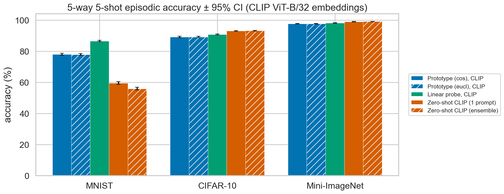
*Figure 3 — 5-way 5-shot episodic accuracy ± 95% CI on CLIP ViT-B/32 embeddings. Zero-shot CLIP leads on natural images; on MNIST it falls behind every support-based head.*

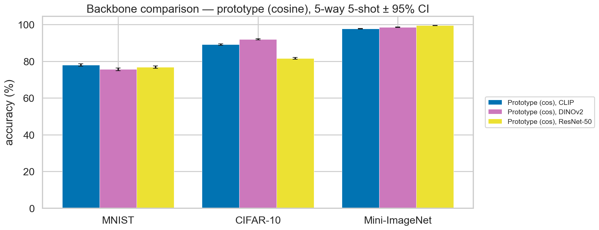
*Figure 4 — Backbone comparison, prototype (cosine), 5-way 5-shot ± 95% CI. Backbone choice moves accuracy more than head choice; the Mini-ImageNet ResNet-50 bar is label-contaminated (§4).*

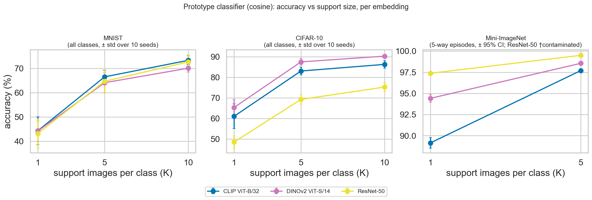
*Figure 5 — Prototype classifier (cosine): accuracy vs. support size, one line per embedding with consistent colors across all charts. Backbone ranking is dataset-dependent: near-tied on MNIST, DINOv2 leads on CIFAR-10, and the ResNet-50 Mini-ImageNet lead is label contamination (†). (Combined all-heads curves: `results/figures/acc_vs_k_*.png`.)*

### 3.2 Simple all-classes protocol (MNIST / CIFAR-10)

Accuracy % on the full 10,000-image test set (10 seeds, ± sample std):

| Classifier | MNIST K=1 | MNIST K=5 | MNIST K=10 | CIFAR-10 K=1 | CIFAR-10 K=5 | CIFAR-10 K=10 |
|---|---|---|---|---|---|---|
| Prototype (cosine) — CLIP | 44.31 ± 5.75 | 66.53 ± 2.70 | 73.32 ± 1.88 | 61.07 ± 6.01 | 83.05 ± 1.84 | 86.26 ± 1.80 |
| Prototype (Euclidean) — CLIP | 44.60 ± 5.66 | 66.37 ± 2.72 | 73.22 ± 1.95 | 62.36 ± 5.48 | 83.02 ± 1.88 | 86.25 ± 1.72 |
| Linear probe — CLIP | **49.95 ± 5.47** | **79.70 ± 1.41** | **88.62 ± 1.41** | **66.69 ± 4.59** | 86.37 ± 1.36 | 88.93 ± 0.79 |
| Prototype (cosine) — DINOv2 | 44.17 ± 4.16 | 64.10 ± 4.23 | 70.08 ± 1.57 | 65.36 ± 3.95 | 87.48 ± 1.62 | **90.25 ± 0.76** |
| Prototype (Euclidean) — DINOv2 | 44.52 ± 4.14 | 64.10 ± 4.19 | 70.03 ± 1.62 | 62.53 ± 4.22 | **87.69 ± 1.51** | 90.22 ± 0.88 |
| Linear probe — DINOv2 | 41.20 ± 3.04 | 72.38 ± 3.08 | 80.00 ± 1.25 | 60.30 ± 4.70 | 85.68 ± 1.68 | 89.69 ± 0.97 |
| Prototype (cosine) — ResNet-50 | 43.16 ± 6.06 | 64.69 ± 4.73 | 72.68 ± 3.01 | 48.59 ± 3.03 | 69.28 ± 2.26 | 75.25 ± 2.16 |
| Prototype (Euclidean) — ResNet-50 | 42.96 ± 5.88 | 64.84 ± 4.63 | 72.70 ± 3.01 | 42.91 ± 3.41 | 68.83 ± 2.31 | 75.07 ± 2.42 |
| Linear probe — ResNet-50 | 44.67 ± 5.41 | 74.43 ± 3.84 | 82.69 ± 1.98 | 45.66 ± 2.09 | 68.20 ± 2.24 | 75.32 ± 1.79 |

Bold = best per column. Zero-shot CLIP (support- and therefore K/seed-independent): MNIST 48.25% (single) / 47.40% (ensemble); CIFAR-10 88.31% / 88.75% — consistent with commonly reported ViT-B/32 zero-shot CIFAR-10 results (≈ 89–90%, e.g. Radford et al., 2021, and the LAION clip_benchmark; our prompt set is smaller than the full published ensemble).

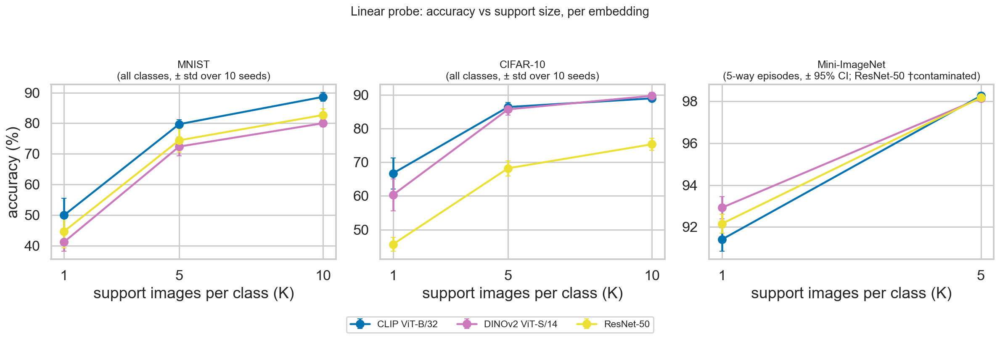
*Figure 6 — Linear probe: accuracy vs. support size, one line per embedding (same colors as Figure 5). CLIP is the strongest probe embedding on MNIST/CIFAR-10 at every K; the fixed a-priori training budget favors its normalized 512-d features (§4).*

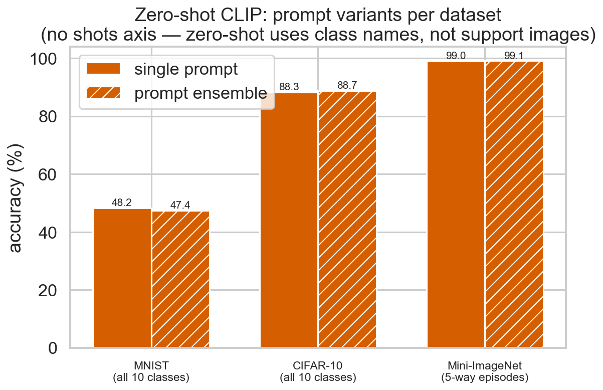
*Figure 7 — Zero-shot CLIP prompt variants per dataset. No shots axis: zero-shot consumes class names, not support images. The ensemble helps on natural images and hurts on MNIST.*

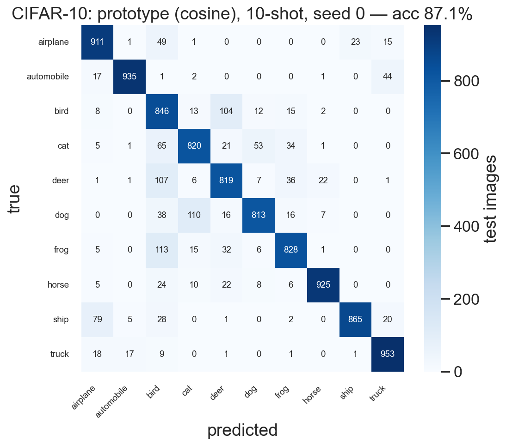
*Figure 8 — CIFAR-10 confusion matrix, prototype (cosine), 10-shot, seed 0. Errors concentrate in the semantically close pairs cat↔dog and bird↔deer. (MNIST counterpart in `results/figures/`.)*

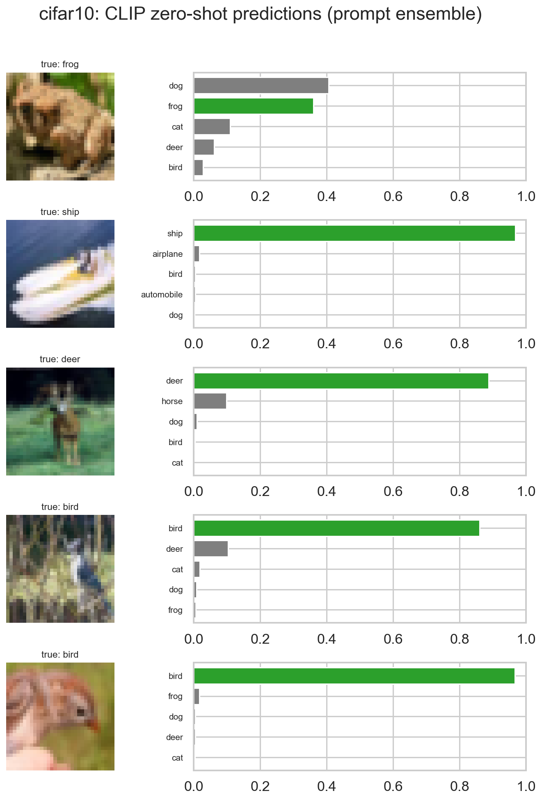
*Figure 9 — Least confident CIFAR-10 zero-shot predictions (prompt ensemble; green = ground-truth class): even the hardest cases are two-way ambiguities between visually similar classes.*

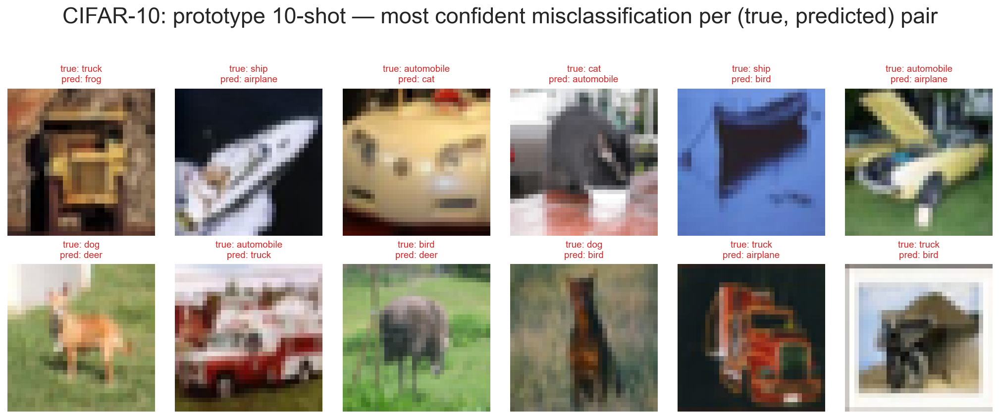
*Figure 10 — Most confident CIFAR-10 prototype misclassifications, one per (true, predicted) pair. Ship→airplane and animal-pair confusions dominate.*

## 4 · Discussion

**Embedding quality dominates head choice.** The spread across backbones (e.g. CIFAR-10 1-shot prototype: DINOv2 77.3 vs CLIP 72.9 vs ResNet-50 62.3) is larger than the spread across heads on a fixed backbone. The t-SNE panels (Figure 11) visualize this *qualitatively* — t-SNE distorts distances and neighborhood structure, so it is illustration, not evidence — while the quantitative embedding-quality metrics in `results/metrics/embedding_quality.csv` (cosine silhouette score, leave-one-out 1-NN accuracy, within/between-class distance ratio) confirm the same backbone ranking numerically.

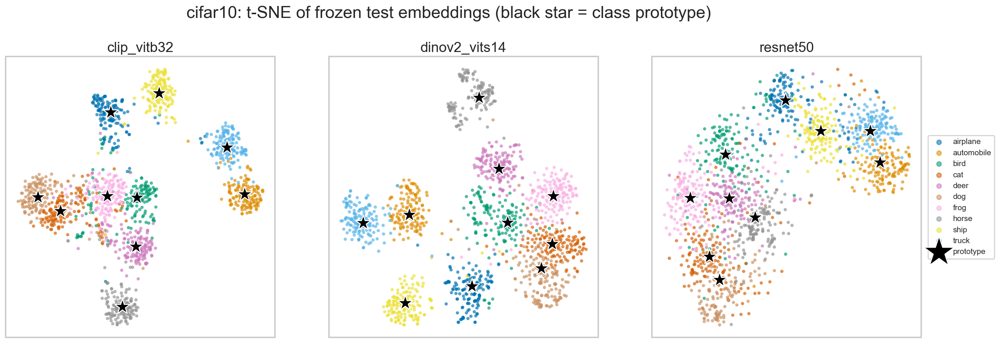
*Figure 11 — t-SNE of frozen CIFAR-10 test embeddings per backbone (black star = class prototype); a qualitative visualization whose apparent class separation is consistent with the quantitative metrics and classification results.*

**Zero-shot CLIP is a very strong baseline on natural images — and fails on MNIST.** On CIFAR-10 and Mini-ImageNet episodic tasks, zero-shot CLIP beats every head that shares its embedding space (93.2 / 99.1% on 5-shot episodes; 93.4 / 99.1% on 1-shot episodes), because its "prototypes" (text embeddings) suffer no 1-or-5-sample estimation noise. (The one head that nominally exceeds it — ResNet-50 prototypes at 99.51% on 5-shot Mini-ImageNet, paired diff +0.40 ± 0.11 vs. the ensemble — is the label-contaminated backbone discussed below, not an honest few-shot comparison.) On MNIST zero-shot collapses to 56–60% episodic / 48% all-classes: handwritten digits are far from CLIP's web-image training distribution. Notably, the prompt *ensemble* hurts MNIST (−2.6 pts episodic 1-shot, −0.85 all-classes): the generic templates dilute the digit-specific prompt — prompt engineering does not transfer across domains without adaptation.

**Prototype vs. linear probe: the ranking is encoder-dependent.** Using CLIP embeddings, the trained probe outperforms the prototype classifier at every evaluated dataset and value of K. This does **not** generalize across encoders. Paired per-episode differences (probe − prototype-cosine, §2.3; positive = probe wins):

| Embeddings | MNIST 1s | MNIST 5s | CIFAR-10 1s | CIFAR-10 5s | Mini-IN 1s | Mini-IN 5s |
|---|---|---|---|---|---|---|
| CLIP | +3.40 ± 0.29 | +8.59 ± 0.41 | +3.94 ± 0.34 | +1.66 ± 0.21 | +2.26 ± 0.30 | +0.56 ± 0.13 |
| DINOv2 | −5.59 ± 0.66 | +4.57 ± 0.41 | −4.58 ± 0.41 | −1.27 ± 0.24 | −1.50 ± 0.22 | −0.41 ± 0.10 |
| ResNet-50 | +1.54 ± 0.38 | +6.44 ± 0.38 | −0.75 ± 0.48 | −1.35 ± 0.33 | −5.23 ± 0.36 † | −1.33 ± 0.15 † |

On CLIP the probe wins all six settings; on DINOv2 the prototype wins five of six (the probe recovers only on MNIST 5-shot); on ResNet-50 the outcome is split. Two forces explain the pattern: (i) where embeddings cluster tightly, class means are near-optimal and training adds little — and at K=1 the probe overfits a single example while the prototype *is* that example; (ii) our probe budget (Adam, 300 steps, lr 0.01, fixed a priori per §2.5) is evidently better matched to CLIP's normalized 512-d features than to DINOv2's CLS tokens or ResNet-50's unnormalized 2048-d activations. Tuning the probe per encoder might close these gaps, but would require validation-split selection (not performed in Stage 1 by design). The honest conclusion is therefore scoped: **with a fixed a-priori training budget, the probe-vs-prototype ranking depends on the encoder** — on MNIST, extra shots consistently benefit the trained boundary more than the mean (the K=1→5 trend is positive for all three encoders), while on well-clustered natural-image embeddings the prototype is the more robust default.

**The Mini-ImageNet pretraining caveat.** Our setting is *few-shot classification over frozen pretrained foundation-model embeddings*, and near-ceiling Mini-ImageNet numbers must be read in that light — they are not comparable to the traditional few-shot literature, where encoders are trained only on the 64 R&L train classes. The strongest form of the caveat applies to ResNet-50: its 97.4% 1-shot prototype accuracy is *not* few-shot skill — the 20 R&L test classes are ImageNet-1k classes, so supervised ResNet-50 saw them, labeled, during pretraining (entries marked † throughout). A weaker form applies to CLIP and DINOv2 as well: neither trains on ImageNet labels, but their web-scale pretraining corpora certainly contain images and semantic categories close to the test classes, which is precisely why their frozen embeddings are so strong. ResNet-50 also shows an 18.7-point cosine-vs-Euclidean gap on 1-shot Mini-ImageNet (97.38 vs 78.69) — its unnormalized feature magnitudes make Euclidean prototype distances noisy at K=1, a classic argument for cosine as the primary metric.

**Multi-prototype ablation: one center is enough at 5-shot; more centers need more shots.** Splitting each class's support into n k-means centers (Figure 12) never helps at 5-shot — paired against the single prototype on each dataset's selected backbone, n = 2/3 is statistically tied on MNIST (−0.32 ± 0.39 / −0.12 ± 0.43), significantly *worse* on CIFAR-10 (−0.94 ± 0.20 / −1.64 ± 0.23) and marginally worse on Mini-ImageNet (−0.10 ± 0.07 / −0.16 ± 0.08): with only five support samples per class, each of n centers is estimated from ~5/n points, and the added estimation noise outweighs any gain from modeling multi-modality. The picture reverses exactly where theory predicts: at MNIST **10-shot** (simple protocol), 3 centers beat the single prototype by a paired **+1.18 ± 1.08** over the 10 seeds — handwritten digits genuinely have multi-modal styles (e.g. crossed vs open 7s), and with ~3 samples per center the extra capacity finally pays. Takeaway for Stage 2: at the 5-shot regime the class mean is the right target representation; multi-center targets only become interesting at higher K.

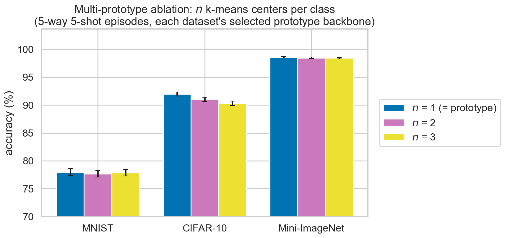
*Figure 12 — Multi-prototype ablation (n k-means centers per class, support only, 5-way 5-shot, each dataset's selected prototype backbone). n = 1 — the plain prototype — is never beaten at 5-shot.*

**Final embedding selection (Stage-2 targets) — on validation data only.** Since the encoder-per-head choice matters (above), each classifier function gets one selected configuration per dataset. To keep the selection leakage-free it follows the standard select-freeze-evaluate protocol: (1) **selection episodes** are drawn from data disjoint from all test evaluation — the 16 R&L *validation* classes for Mini-ImageNet (their canonical purpose) and train-split episodes for MNIST/CIFAR-10 (seed 123, 600 episodes per K); (2) for each (dataset, head) **one configuration across all K** is chosen by mean validation accuracy, and must beat the runner-up in a paired per-episode comparison on the same validation episodes — a statistical tie goes to the *smaller* embedding; (3) the selected configuration's **test** numbers are read out once as the Stage-2 reference. Zero-shot CLIP is selected by *prompt variant* (single vs ensemble) — K is not part of its identity since it uses no support. ResNet-50 is excluded on Mini-ImageNet: the validation classes are ImageNet-1k classes too, so selecting it would inherit the label contamination. The result is committed machine-readably to `results/artifacts/best_baselines.json` (all validation accuracies: `results/metrics/selection_validation.csv`):

| Head | MNIST | CIFAR-10 | Mini-ImageNet |
|---|---|---|---|
| Prototype | **CLIP** (Euclidean; val tie +0.04 ± 0.07 → CLIP kept) | **DINOv2** (cosine; +1.16 ± 0.18) | **DINOv2** (cosine; +0.43 ± 0.11) |
| Linear probe | **CLIP** (+2.51 ± 0.50) | **CLIP** (+1.67 ± 0.44) | **CLIP** (+0.67 ± 0.26) |
| Zero-shot CLIP | **single prompt** (+2.96 ± 0.55) | **prompt ensemble** (+0.24 ± 0.07) | **prompt ensemble** (+0.06 ± 0.03) |

Parenthesized values are the paired validation margins over the runner-up (mean ± 95% CI on the same validation episodes). The selected configurations' one-time test read-outs (the numbers Stage 2 must beat, from §3.1): e.g. CIFAR-10 prototype-DINOv2 77.34/91.95%, MNIST linear-CLIP 59.96/86.60% (1-shot/5-shot); full values in `best_baselines.json`. Reassuringly, the validation-based selection agrees with what test-based selection would have chosen — evidence the choice generalizes rather than overfits the selection set.

A Stage-2 Flow-Matching variant of a head counts as an improvement only if it beats *this* configuration of that head (paired per-episode CI on the same test episode files). Figure 13 shows the advised Stage-2/3 architectures, each built on its dataset's selected embedding.

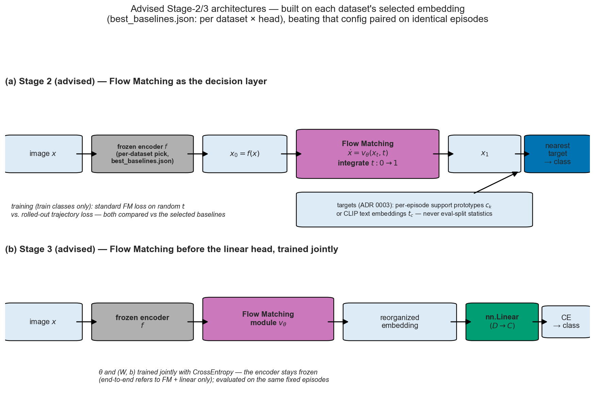
*Figure 13 — Advised Stage-2/3 architectures. Stage 2 transports embeddings toward per-episode support prototypes or CLIP text embeddings (ADR 0003) and classifies by nearest target; Stage 3 inserts the Flow-Matching module before the linear head, trained jointly with CE while the encoder stays frozen. Both use each dataset's selected encoder from `best_baselines.json`.*

**Headroom for Stages 2–3.** Mini-ImageNet 5-way is near ceiling (≥ 97% for most heads) and will not differentiate Flow-Matching variants; MNIST (78% prototype / 86.6% probe at 5-shot, 73/88.6% at all-classes 10-shot) and the CIFAR-10 support-based heads leave the clearest headroom. This is where Stage 2/3 gains should be demonstrated.

## 5 · Limitations

- Frozen encoders bound absolute accuracy; no fine-tuning or adaptation is attempted (by design — the head is the object of study).
- Episodic results on MNIST/CIFAR-10 sample 5-way tasks from only 10 classes, so episodes share classes (standard, but CIs are correlated across episodes).
- Mini-ImageNet's simple protocol is omitted: its R&L test pool has no train/test image split; adding one would deviate from the canonical protocol.

## 6 · Extensions beyond the specification

| Extension | Justification |
|---|---|
| Backbone comparison (CLIP vs DINOv2 vs ResNet-50) | isolates embedding quality from head choice |
| Euclidean prototype ablation | classic ProtoNet uses Euclidean; cosine is the modern default — both reported |
| Prompt-ensemble ablation for zero-shot CLIP | quantifies prompt engineering's contribution |
| Committed episode index files | exact (not just statistical) comparability for Stages 2–3 |
| Independent repro check from raw artifacts | table numbers are verifiable without re-running experiments |
| Episodic protocol also run on MNIST/CIFAR-10 | the spec assigns them the simple protocol only; episodic runs added for cross-dataset comparability with Mini-ImageNet |
| Episode/feature integrity fingerprints + pinned dataset revision | any upstream dataset change fails loudly instead of silently corrupting labels |
| Batched episodic probe training + equivalence benchmark | 600 heads trained jointly; Figure 14 proves identical predictions at 373–455× speedup |
| Linear probe evaluated on all three backbones | full head × encoder grid; revealed that the probe-vs-prototype ranking is encoder-dependent (§4) |
| Quantitative embedding-quality metrics | silhouette / 1-NN / distance-ratio table backs the qualitative t-SNE reading |
| Multi-prototype (k-means) ablation, n ∈ {1,2,3} | support-only clustering; shows one center suffices at 5-shot, multi-modality pays only at K=10 (MNIST +1.18 ± 1.08) |

### Engineering benchmark: batched vs sequential probe training

A naive implementation trains the 600 per-episode linear heads one at a time; ours trains them jointly (§2.4). `scripts/bench_probe.py` runs both on every episodic configuration from the *same seeded initialization* and compares predictions query-by-query (Figure 14): the two are **identical on all 45,000 queries of every configuration**, while the batched implementation is 373–455× faster — the full probe grid takes 1.3 s instead of 9.1 min. The gap is kernel-launch overhead: sequential training issues 180,000 GPU steps on microscopic 5×512 problems, whereas batching issues 300 steps on `[600, C, 512]` tensors. The speedup is therefore pure engineering, with provably zero effect on any reported number.

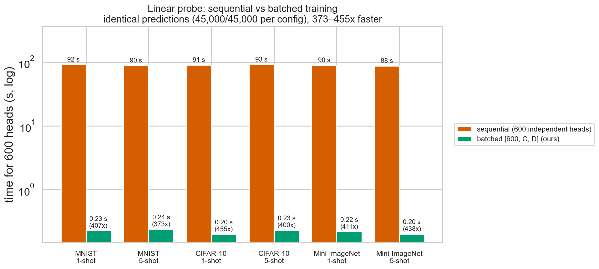
*Figure 14 — Sequential vs batched linear-probe training on all six episodic configurations (log scale). Same initialization, identical predictions (45,000/45,000 per configuration), 373–455× faster.*

## References

- Chen, T., Kornblith, S., Norouzi, M., & Hinton, G. (2020). *A Simple Framework for Contrastive Learning of Visual Representations* (SimCLR). ICML 2020.
- Oquab, M., Darcet, T., Moutakanni, T., et al. (2023). *DINOv2: Learning Robust Visual Features without Supervision*. TMLR 2024.
- Radford, A., Kim, J. W., Hallacy, C., et al. (2021). *Learning Transferable Visual Models From Natural Language Supervision* (CLIP). ICML 2021.
- Ravi, S., & Larochelle, H. (2017). *Optimization as a Model for Few-Shot Learning*. ICLR 2017. (Source of the Mini-ImageNet 64/16/20 class split.)
- Snell, J., Swersky, K., & Zemel, R. (2017). *Prototypical Networks for Few-shot Learning*. NeurIPS 2017.
- He, K., Zhang, X., Ren, S., & Sun, J. (2016). *Deep Residual Learning for Image Recognition* (ResNet). CVPR 2016.
- LAION *clip_benchmark* — reference zero-shot accuracies for OpenAI CLIP ViT-B/32.
