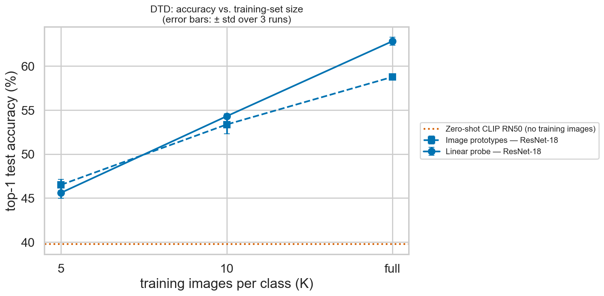
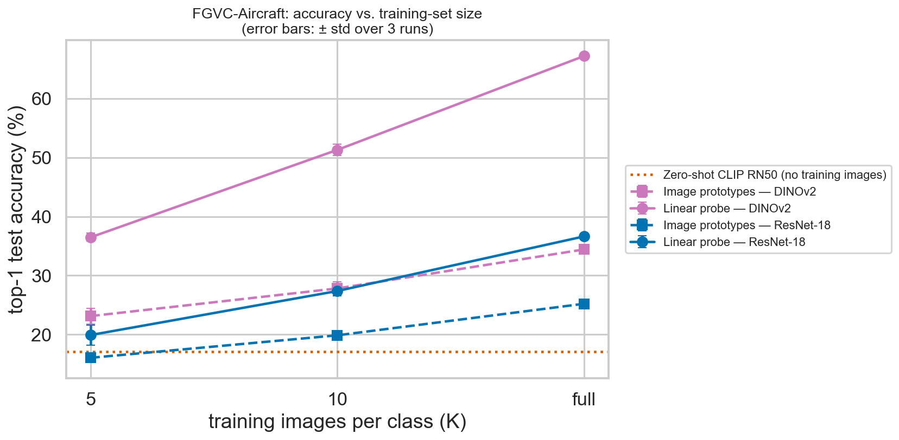
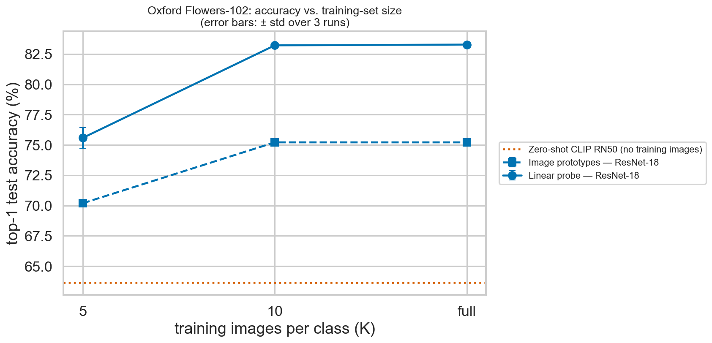
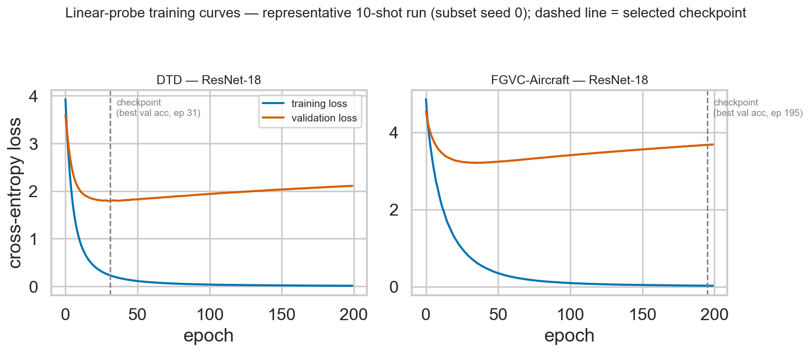
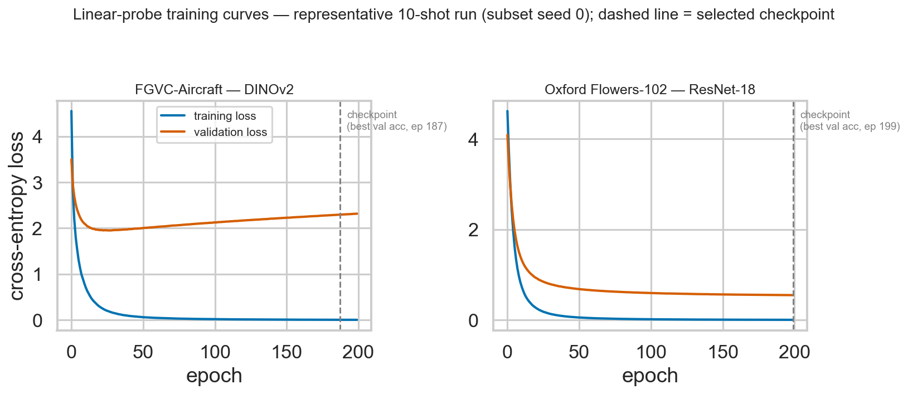
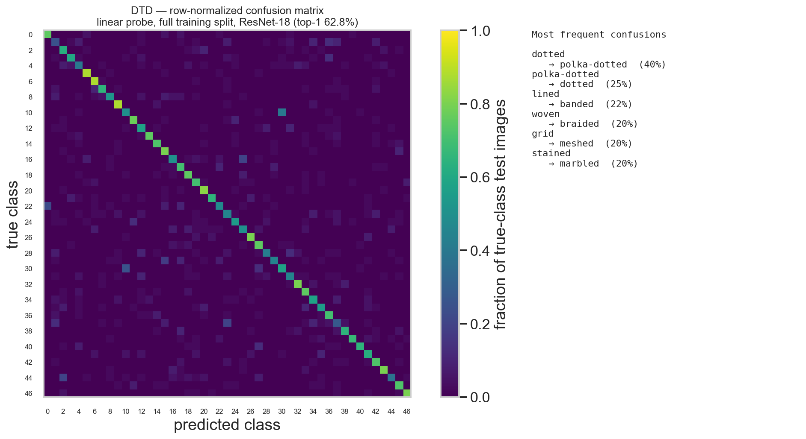
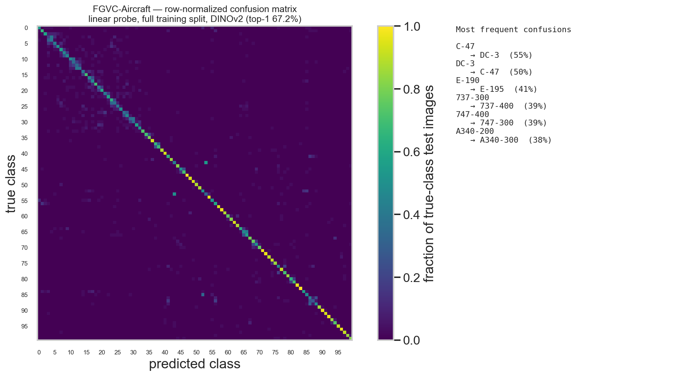
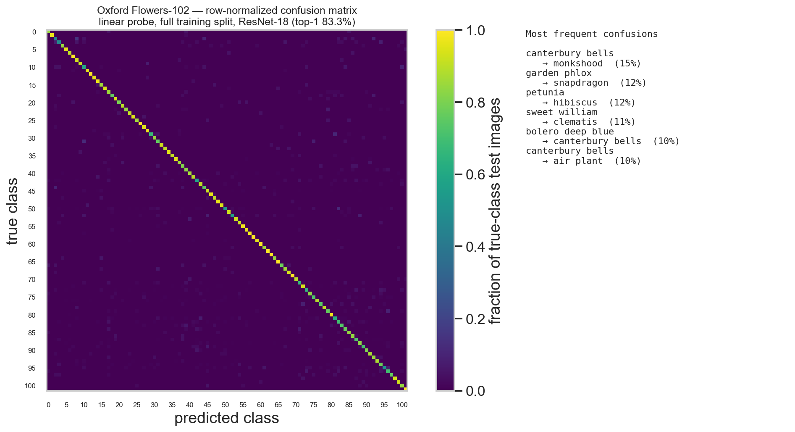
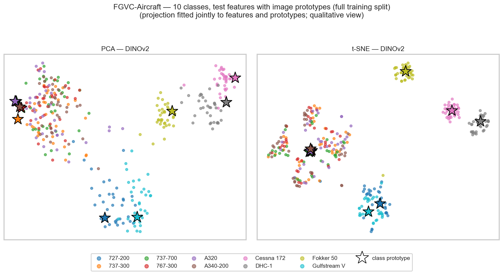
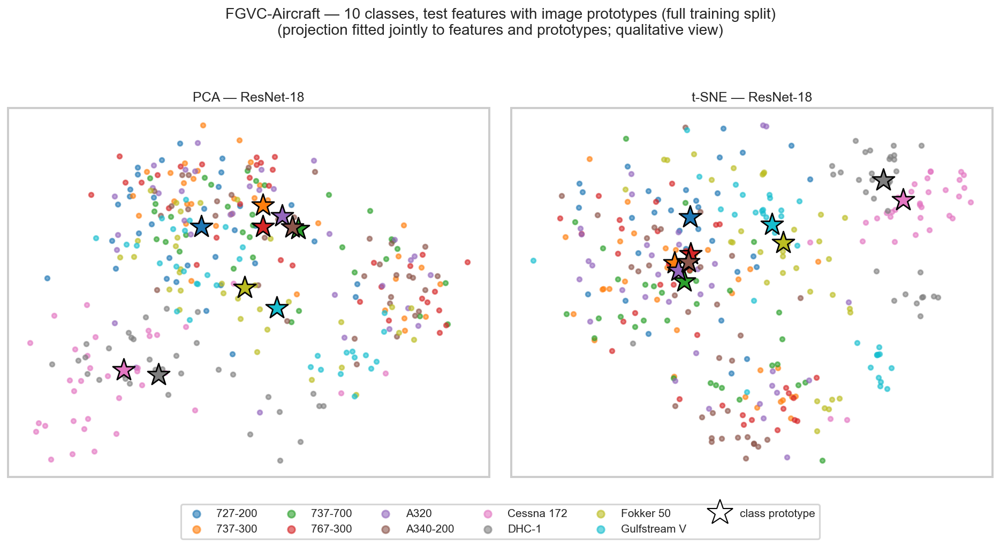

# Stage 1 Report — Classification Baselines on Frozen Pretrained Encoders

**Project:** CVLAB Summer Project — Stage 1
**Author:** Alon Engel
**Datasets:** DTD · FGVC-Aircraft · Oxford Flowers-102
**Specification:** `_docs/stage_1.pdf` (single source of truth, ADR 0004)
**Date:** July 2026

---

## Abstract

We establish reproducible classification baselines on frozen pretrained encoders for DTD, FGVC-Aircraft and Oxford Flowers-102, using all classes and the official train/validation/test splits with training-set sizes of 5, 10 and all available images per class. Three heads are compared on cached frozen features: the required linear probe, image-derived class prototypes, and zero-shot CLIP — the specification asks for the probe plus one prototype branch, and we implement both so the branch continuing into Stage 2 can be chosen from evidence. Two results dominate. First, the representation matters far more than the head: on FGVC-Aircraft, replacing ImageNet-supervised ResNet-18 with self-supervised DINOv2 ViT-S/14 lifts the full-split linear probe from 36.6% to 67.2%, and the DINOv2 probe trained on five images per class already equals the ResNet-18 probe trained on the entire split. Second, image prototypes are competitive only in the lowest-data regime — they lead at DTD 5-shot (46.5 vs 45.6) and lose everywhere else, by a margin that widens with training-set size. Zero-shot CLIP RN50, which uses no labeled training images, reaches 63.6% on Flowers-102, 39.8% on DTD and 17.0% on FGVC-Aircraft. Linear-probe training curves show clear overfitting absorbed by validation-accuracy checkpointing. On the measured headroom we recommend the image-prototype branch for Stage 2. All numbers are re-derivable from committed raw artifacts.

## 1 · Introduction

The goal of Stage 1 is a reliable and reproducible classification pipeline built on **frozen** pretrained encoders; no flow-matching component appears at this stage. The specification names three candidate baselines — linear probing, classification with image-derived class prototypes, and zero-shot CLIP classification with text-derived prototypes — and asks each group to implement the linear probe plus **one** of the two prototype branches. The selected prototype branch is carried into Stage 2, and the linear-probe setting into Stage 3.

We implement the required linear probe and **both** prototype branches (ADR 0005), so that the branch continuing into Stage 2 can be chosen from measured evidence rather than assumed. Concretely:

1. **Linear probe** (required) — a multiclass linear classifier $s = Wz + b$ over the frozen feature $z$, trained with softmax cross-entropy; only $W$ and $b$ are trained.
2. **Image-derived class prototypes** (branch A) — cosine classification against class means of $L_2$-normalized training features.
3. **Zero-shot CLIP** (branch B) — cosine classification against CLIP RN50 text prototypes built from class-name prompts; uses no labeled training images.

## 2 · Experimental setup

### 2.1 Datasets and official splits

The specification asks for two of three datasets; we run all three and mark the third (‡) as beyond the required pair (ADR 0005). All classes are used, with the **official** train / validation / test splits; DTD uses partition 1 and FGVC-Aircraft the `variant` annotation level. Training and validation splits are never merged.

| Dataset | Classes | Train | Validation | Test | Train images per class |
|---|---|---|---|---|---|
| DTD (partition 1) | 47 | 1,880 | 1,880 | 1,880 | 40 |
| FGVC-Aircraft (`variant`) | 100 | 3,334 | 3,333 | 3,333 | 33–34 |
| Oxford Flowers-102 ‡ | 102 | 1,020 | 1,020 | 6,149 | 10 |

(Generated into `results/metrics/dataset_splits.csv`. Flowers-102's test split is class-imbalanced, 20–238 images per class, as published.)

The spec-selected pair is **DTD + FGVC-Aircraft**, chosen because their training splits (40 and ~33 images per class) make $K \in \{5, 10, \text{full}\}$ three genuinely distinct settings. Flowers-102's official training split holds exactly 10 images per class, so for that dataset the 10-shot setting *is* the full setting — a structural degeneracy we report rather than hide.

### 2.2 Training-set sizes and subset sampling

For every method that uses labeled training examples we evaluate $K \in \{5, 10, \text{full}\}$ training images per class. For $K \in \{5, 10\}$ a **balanced** subset is sampled from the official training split with seeds $\{0, 1, 2\}$; the resulting indices are committed to `results/artifacts/subsets/` so that every encoder and every head is trained on bit-identical images. The `full` setting is the complete official training split.

### 2.3 Frozen encoders (ADR 0001)

All encoder parameters remain frozen, and each checkpoint is used with its own associated preprocessing. Train, validation and test features are extracted once per (dataset, encoder) and cached; classifier training and evaluation only ever read the caches.

| Encoder | Source | Representation | Used on |
|---|---|---|---|
| ResNet-18 (ImageNet-1K) | torchvision `ResNet18_Weights.IMAGENET1K_V1` | 512-d, taken before the final classification layer | all three datasets |
| DINOv2 ViT-S/14 | `facebook/dinov2-small` | final class-token representation (384-d) | FGVC-Aircraft |
| CLIP RN50 | official OpenAI `clip` package | image encoder (1024-d) + text encoder | zero-shot branch only |

DINOv2 is applied to FGVC-Aircraft, the fine-grained task, where the contrast between ImageNet-supervised and self-supervised features is most informative. CLIP RN50 is used strictly for the zero-shot branch, as the specification restricts it.

### 2.4 Baselines

**Linear probe.** $s = Wz + b$ with softmax cross-entropy; only $W$ and $b$ are trained. The specification's suggested configuration was adopted unchanged and fixed a priori: AdamW, learning rate $10^{-3}$, weight decay $10^{-4}$, batch size 64, at most 200 epochs, and **checkpoint selection by highest validation accuracy**. No hyperparameter search was performed — the objective is a reasonable and stable probe, since the comparison that matters later concerns the Flow Matching layer.

**Image-derived class prototypes.** Features are $L_2$-normalized, then for every class $c$

$$\mu_c = \mathrm{normalize}\left(\frac{1}{|S_c|}\sum_{i \in S_c} \mathrm{normalize}(z_i)\right), \qquad \hat{y} = \arg\max_c \cos(z, \mu_c),$$

where $S_c$ is the selected **training** subset for class $c$. Nothing is trained, so the only run-to-run variation is the choice of training subset.

**Zero-shot CLIP.** One text prototype per class from the frozen CLIP RN50 text encoder, using the specified prompts — `a photo of a {class} texture` (DTD), `a photo of a {class} aircraft` (FGVC-Aircraft), `a photo of a {class} flower` (Flowers-102). Image and text embeddings are normalized and classified by $\hat{y} = \arg\max_c \cos(z, t_c)$. This branch consumes no labeled training images and therefore yields exactly one result per dataset.

### 2.5 Runs, seeds and evaluation

Every reported number is **top-1 accuracy on the complete official test split**. Each training-set size is run three times:

| Setting | The 3 runs vary | Held fixed | Reported as |
|---|---|---|---|
| 5-shot, 10-shot | balanced-subset seed ∈ {0,1,2} | classifier initialization | mean ± std |
| full — linear probe | initialization seed ∈ {0,1,2} | training set | mean ± std |
| full — image prototypes | — (deterministic) | — | single run |
| zero-shot CLIP | — (deterministic, no training images) | — | single run |

Each setting therefore has exactly one interpretable source of variance: training-subset sampling at 5/10-shot, initialization at full. Single-run settings are reported without a standard deviation rather than as "± 0.00".

The validation split is used **only** for linear-probe checkpoint selection. No hyperparameter, encoder, subset, or checkpoint was chosen by observing test accuracy.

### 2.6 Reproducibility

Balanced training subsets are saved as index files carrying a fingerprint of the training-split labels, so a dataset change fails loudly instead of silently shifting the data. Per-run accuracies are written to `results/metrics/raw/`, per-run details to `runs.csv`, and aggregates to `summary.csv`; `scripts/repro_check.py` re-derives every mean and standard deviation in this report from the raw arrays. `results/runtime_summary.json` records versions and hardware. The whole pipeline is re-runnable with `tasks.ps1 data | extract | run | tables | figures | check`.

## 3 · Results

Every number below is top-1 accuracy (%) on the complete official test split, re-derivable from the committed raw arrays via `scripts/repro_check.py` (last run: 27/27 summary rows match).

### 3.1 Accuracy table

| Dataset | Encoder | Baseline | K = 5 | K = 10 | full train split | no training images |
|---|---|---|---|---|---|---|
| DTD | ResNet-18 | Linear probe | 45.60 ± 0.64 | 54.31 ± 0.28 | **62.84 ± 0.45** | — |
| DTD | ResNet-18 | Image prototypes | **46.51 ± 0.64** | 53.37 ± 1.04 | 58.78 | — |
| DTD | CLIP RN50 | Zero-shot CLIP | — | — | — | 39.79 |
| FGVC-Aircraft | ResNet-18 | Linear probe | 19.90 ± 1.72 | 27.36 ± 0.83 | 36.62 ± 0.27 | — |
| FGVC-Aircraft | ResNet-18 | Image prototypes | 16.04 ± 0.83 | 19.85 ± 0.47 | 25.20 | — |
| FGVC-Aircraft | DINOv2 | Linear probe | **36.47 ± 0.70** | **51.30 ± 0.95** | **67.21 ± 0.11** | — |
| FGVC-Aircraft | DINOv2 | Image prototypes | 23.11 ± 1.36 | 27.80 ± 1.17 | 34.41 | — |
| FGVC-Aircraft | CLIP RN50 | Zero-shot CLIP | — | — | — | 17.04 |
| Oxford Flowers-102 ‡ | ResNet-18 | Linear probe | **75.58 ± 0.84** | **83.22 ± 0.00** | **83.28 ± 0.11** | — |
| Oxford Flowers-102 ‡ | ResNet-18 | Image prototypes | 70.19 ± 0.14 | 75.22 ± 0.00 | 75.22 | — |
| Oxford Flowers-102 ‡ | CLIP RN50 | Zero-shot CLIP | — | — | — | 63.64 |

5-shot / 10-shot: mean ± std over the 3 training-subset seeds. Full linear probe: mean ± std over the 3 initialization seeds. Full image prototypes and zero-shot CLIP are single deterministic runs. ‡ beyond the spec's required pair. The std of exactly 0.00 at Flowers-102 K = 10 is not rounding: that dataset's official training split holds exactly 10 images per class, so all three 10-shot subsets are the same images.

External sanity check: our CLIP RN50 zero-shot numbers (DTD 39.8, FGVC-Aircraft 17.0, Flowers-102 63.6) sit just below the commonly reported values for this checkpoint (≈ 41.7, 19.3, 65.9), consistent with our use of the specification's single prompt rather than a prompt ensemble.

### 3.2 Accuracy versus training-set size

*Figure 1 — DTD. Image prototypes lead at K = 5; the trained probe overtakes them by K = 10 and pulls clearly ahead on the full split. Zero-shot CLIP (dotted) sits below every supervised setting.*

*Figure 2 — FGVC-Aircraft. The encoder, not the head, dominates: the DINOv2 probe with **5 images per class** (36.5%) already matches the ResNet-18 probe trained on the **full** split (36.6%). Zero-shot CLIP RN50 (17.0%) is competitive with 5-shot ResNet-18 prototypes.*

*Figure 3 — Flowers-102 ‡. The 10-shot and full points coincide because the official training split contains exactly 10 images per class; the apparent plateau is a property of the split, not of the method.*

### 3.3 Training curves

*Figures 4–5 — Representative 10-shot linear-probe runs (subset seed 0), one per dataset–encoder combination; the dashed line marks the selected checkpoint. Training is smooth and monotone in every case. On DTD and FGVC-Aircraft the validation loss reaches a minimum near epoch 20–30 and then rises while the training loss goes to zero — clear overfitting of the probe at this training-set size, which is precisely what checkpoint selection on validation accuracy is there to absorb.*

A detail worth noting in Figure 5 (FGVC-Aircraft / DINOv2): validation *loss* rises from about epoch 25 onward, yet the best validation *accuracy* occurs at epoch 187. Loss and accuracy diverge because the probe becomes increasingly over-confident on the examples it already gets wrong — cross-entropy penalises that, top-1 accuracy does not. Selecting on accuracy, as the specification requires, is therefore not the same as selecting on loss.

**Is the 200-epoch budget adequate?** 8 of the 36 probe runs reach their best validation accuracy at epoch ≥ 190, so the cap is mildly binding. Inspecting the saved curves, validation accuracy gains over the last 100 epochs are +0.63 (FGVC/DINOv2), +0.81 (FGVC/ResNet-18) and +0.98 (Flowers-102) points, i.e. within roughly one point of the plateau and comparable to the run-to-run spread. The suggested configuration therefore behaves reasonably and was **kept unchanged**; no deviation is reported.

### 3.4 Confusion matrices

*Figure 6 — DTD, row-normalized, best full-split linear probe. Errors are concentrated in semantically adjacent texture pairs: dotted → polka-dotted (40% of that class's test images), polka-dotted → dotted (25%), lined → banded (22%), grid → meshed (20%), stained → marbled (20%).*

*Figure 7 — FGVC-Aircraft, row-normalized. Confusions concentrate within airframe families (variants of the same aircraft), which is the defining difficulty of this dataset.*

*Figure 8 — Oxford Flowers-102 ‡, row-normalized. The matrix is strongly diagonal, consistent with the 83% top-1 accuracy.*

### 3.5 Feature visualizations

*Figure 9 — FGVC-Aircraft, DINOv2 features for 10 classes with their image-derived prototypes (stars), PCA and t-SNE, projections fitted jointly to the plotted features and prototypes. Distinctive light aircraft (Cessna 172, DHC-1, Fokker 50) form tight, well-separated clusters, while the Boeing/Airbus narrow- and wide-bodies (737-300, 737-700, 767-300, A320, A340-200) overlap heavily — a direct visual account of where the remaining 33% of errors come from.*

*Figure 10 — The same 10 classes, same test images and same colours, with ResNet-18 features. Cluster structure is markedly weaker than in Figure 9, matching the 30-point accuracy gap.*

Corresponding figures for the remaining dataset–encoder combinations, including the CLIP panels that show test-image embeddings together with their **text** prototypes, are in `results/figures/features_*.png`.

## 4 · Discussion

**The representation dominates the head.** On FGVC-Aircraft, swapping ResNet-18 for DINOv2 while holding everything else fixed moves the full-split linear probe from 36.62% to 67.21% — a 30.6-point gain, far larger than any difference between heads on a fixed encoder. The sharpest way to state it: the DINOv2 probe trained on **5 images per class** (36.47%) is already as accurate as the ResNet-18 probe trained on the **entire** training split (36.62%). Self-supervised features transfer to fine-grained recognition in a way ImageNet-supervised ResNet-18 features do not, and Figures 9–10 show the reason directly in the feature space.

**Prototypes win only in the low-data regime, and only sometimes.** The image-prototype head beats the linear probe at exactly one setting in the whole grid — DTD at K = 5 (46.51 vs 45.60) — and is beaten everywhere else, by a margin that grows with the training-set size (DTD full: 58.78 vs 62.84; FGVC-Aircraft/DINOv2 full: 34.41 vs 67.21). This is the expected behaviour: a class mean is a well-conditioned estimator when five examples are all one has, but it cannot exploit additional data the way a discriminatively trained boundary can, and it is blind to the fact that some feature directions separate classes better than others. The effect is strongest where classes are entangled — on FGVC-Aircraft the prototype head recovers barely half the probe's accuracy.

**Zero-shot CLIP is a genuinely different trade-off.** It uses no labeled training images at all, and on Flowers-102 (63.64%) it lands within 12 points of a ResNet-18 probe trained on the full split, and above what that probe would achieve with only a couple of images per class. On DTD it reaches 39.79%, below every supervised setting but not by much at K = 5. On FGVC-Aircraft it manages 17.04% — above 5-shot ResNet-18 prototypes (16.04%) — which says more about the difficulty of the task than about CLIP. The pattern is consistent with CLIP's pretraining distribution: flowers and textures are describable in natural language, aircraft *variants* essentially are not ("a photo of a 737-300 aircraft" carries little visual signal).

**Overfitting is real and is handled by the protocol.** The training curves (Figures 4–5) show the probe driving training loss to zero at every training-set size while validation loss turns upward within a few dozen epochs. Checkpoint selection on validation accuracy is doing substantial work here, and the divergence between validation loss and validation accuracy on FGVC-Aircraft/DINOv2 is a reminder that the two are not interchangeable selection criteria.

**Which branch should carry into Stage 2.** On the evidence above we recommend **Option A, image-derived class prototypes**:

1. *Headroom.* The prototype head sits far below the linear probe on the same frozen features (34.41 vs 67.21 on FGVC-Aircraft/DINOv2; 58.78 vs 62.84 on DTD). That gap is exactly the space a Flow Matching decision layer has to demonstrate a gain in. Zero-shot CLIP's gap is comparable but the branch offers no knob that varies with the training data.
2. *Experimental surface.* Image prototypes depend on both the encoder and K, so Stage 2 inherits a grid of targets (3 training sizes × the encoders already cached) rather than a single fixed text embedding per class.
3. *Encoder freedom.* Option A can be built on the strongest representation available (DINOv2 on FGVC-Aircraft), whereas Option B is locked to CLIP RN50 by construction — and CLIP RN50 is the weakest of the three encoders on the fine-grained task.
4. *Continuity with Stage 3.* Option A reuses precisely the caches the linear probe uses, so the Stage-2 and Stage-3 comparisons rest on the same representation.

Both branches are implemented and reported, so this recommendation can be revisited without re-running anything.

## 5 · Limitations

- Frozen encoders bound absolute accuracy by design; no adaptation of the representation is attempted at this stage.
- The linear-probe configuration is the specification's suggested baseline, adopted without search. Better numbers are certainly reachable per dataset, but tuning was explicitly out of scope and would have to be done on the validation split.
- Flowers-102's official training split contains exactly 10 images per class, so its 10-shot and full settings coincide; its three 10-shot runs are identical by construction and carry zero spread.
- Two-dimensional feature projections are qualitative only: both PCA and t-SNE distort the geometry of the frozen feature spaces.

## 6 · Deviations from, and extensions beyond, the specification

| Item | Status | Justification |
|---|---|---|
| Third dataset (Flowers-102) | extension ‡ | the spec asks for two; the third is cheap, and its 10-images-per-class training split is an instructive degenerate case. The required pair (DTD + FGVC-Aircraft) is marked and can be read on its own. |
| Both prototype branches | extension | the spec asks for one; implementing both lets the Stage-2 branch be chosen on evidence. The exactly-compliant subset is the linear probe plus either branch. |
| Linear-probe configuration | as specified | AdamW / 1e-3 / 1e-4 / 64 / 200 epochs / best-val-accuracy checkpoint, unchanged. |
| DINOv2 coverage | as specified | one dataset (FGVC-Aircraft). |
| CLIP RN50 usage | as specified | zero-shot branch only; never used as a probe or prototype backbone. |
| Feature visualizations | as specified, both projections | PCA *and* t-SNE panels are shown; the spec allows either. |

## References

- Cimpoi, M., Maji, S., Kokkinos, I., Mohamed, S., & Vedaldi, A. (2014). *Describing Textures in the Wild* (DTD). CVPR 2014.
- Maji, S., Rahtu, E., Kannala, J., Blaschko, M., & Vedaldi, A. (2013). *Fine-Grained Visual Classification of Aircraft* (FGVC-Aircraft). arXiv:1306.5151.
- Nilsback, M.-E., & Zisserman, A. (2008). *Automated Flower Classification over a Large Number of Classes* (Oxford Flowers-102). ICVGIP 2008.
- He, K., Zhang, X., Ren, S., & Sun, J. (2016). *Deep Residual Learning for Image Recognition* (ResNet). CVPR 2016.
- Oquab, M., Darcet, T., Moutakanni, T., et al. (2023). *DINOv2: Learning Robust Visual Features without Supervision*. TMLR 2024.
- Radford, A., Kim, J. W., Hallacy, C., et al. (2021). *Learning Transferable Visual Models From Natural Language Supervision* (CLIP). ICML 2021.
- Snell, J., Swersky, K., & Zemel, R. (2017). *Prototypical Networks for Few-shot Learning*. NeurIPS 2017.
- Loshchilov, I., & Hutter, F. (2019). *Decoupled Weight Decay Regularization* (AdamW). ICLR 2019.
